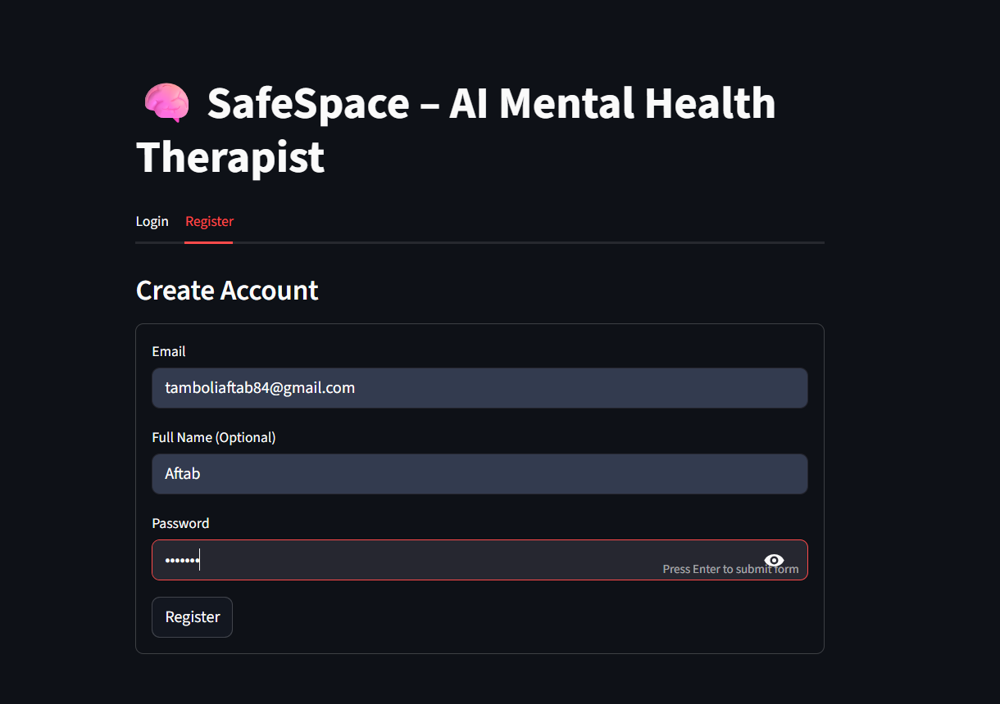
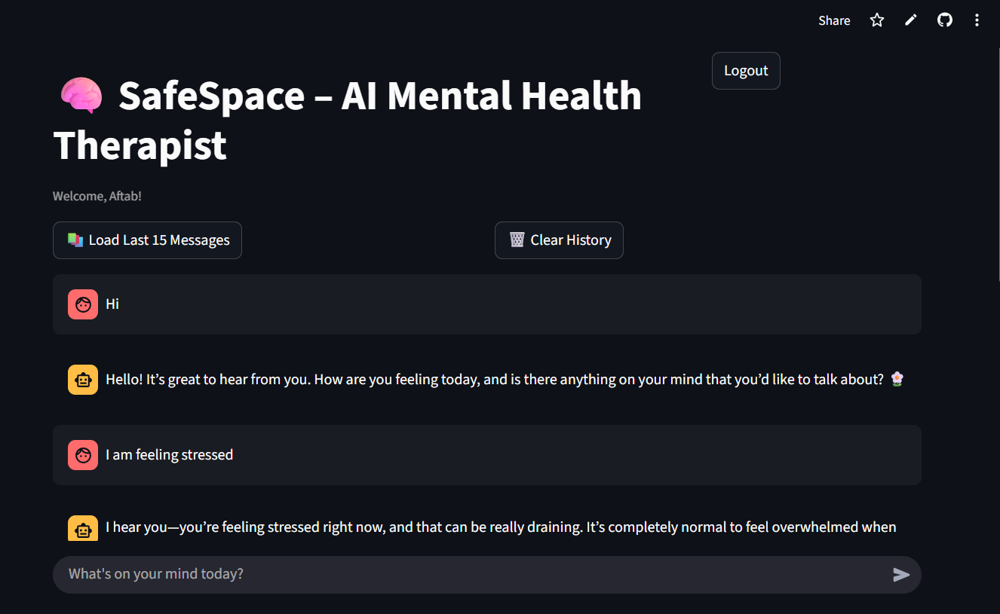
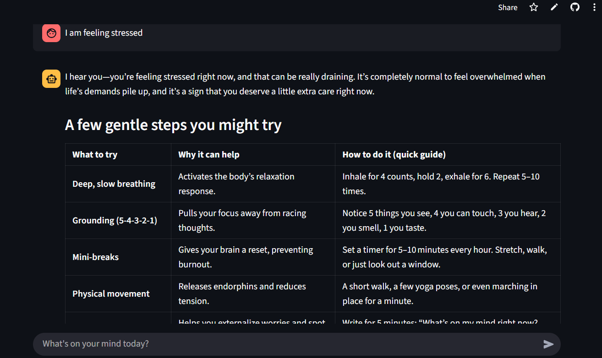

```markdown
# 🧠 SafeSpace - AI Mental Health Companion

An intelligent, empathetic AI-powered mental health support system that provides 24/7 emotional support, crisis detection, and therapeutic guidance.


## 🌟 Live Demo

**🔗 Try it now:** [https://safespace1.streamlit.app/]

**📚 API Documentation:** [https://safespace-backend-vgv4.onrender.com/docs]

---

## ✨ Features

### 🤖 AI-Powered Therapy
- Conversational AI trained on mental health best practices
- Empathetic, non-judgmental responses
- Evidence-based coping strategies
- Personalized emotional support

### 🚨 Crisis Detection & Emergency Response
- Real-time analysis of user messages for crisis indicators
- Automatic emergency contact via Twilio
- Immediate intervention for high-risk situations
- Safety-first approach

### 💬 Intelligent Conversation Management
- Persistent chat history with PostgreSQL
- Context-aware responses
- Load previous conversations
- Clear history option

### 🔐 Secure Authentication
- JWT-based authentication
- Bcrypt password hashing
- Protected API endpoints
- User session management

### 🔍 Additional Tools
- **Therapist Finder**: Locate licensed mental health professionals
- **Mood Tracking**: Monitor emotional patterns (coming soon)
- **Resource Library**: Access mental health resources (coming soon)

---

## 📸 Screenshots

### Login & Registration

*Secure user authentication with modern UI*

### Chat Interface

*Clean, intuitive conversation interface*

### Chat History

*Load and manage previous conversations*

### Emergency Response

*Automatic crisis detection and intervention*

---

## 🏗️ Architecture

```
┌─────────────────┐
│   Streamlit     │ ← Frontend (User Interface)
│   Cloud         │
└────────┬────────┘
         │ HTTPS
         │
┌────────▼────────┐
│   FastAPI       │ ← Backend API
│   (Render)      │
└────┬────────┬───┘
     │        │
     │        └─────► PostgreSQL (User Data & History)
     │
     ├──────────────► Groq API (AI Model - LLaMa)
     │
     ├──────────────► Twilio (Emergency Calls)
     │
     └──────────────► LangChain (Agent Framework)
```

---

## 🛠️ Tech Stack

### Frontend
- **Streamlit** - Interactive web interface
- **Python Requests** - API communication

### Backend
- **FastAPI** - Modern Python web framework
- **Uvicorn** - ASGI server
- **SQLAlchemy** - Database ORM
- **PostgreSQL** - Relational database

### AI & ML
- **LangChain** - AI agent framework
- **LangGraph** - Agent workflow orchestration
- **Groq API** - LLaMA model inference
- **OpenAI GPT** - Natural language processing

### Authentication & Security
- **JWT** - Token-based authentication
- **Bcrypt** - Password hashing
- **Python-JOSE** - JWT handling

### External Services
- **Twilio** - Emergency call system
- **Render** - Backend hosting
- **Streamlit Cloud** - Frontend hosting

---

## 🚀 Getting Started

### Prerequisites
- Python 3.12+
- PostgreSQL (for production)
- Groq API Key
- Twilio Account (for emergency features)

### Local Development

1. **Clone the repository**
```
git clone https://github.com/Aftab073/SAFESPACE-AI-AGENT.git
cd SAFESPACE-AI-AGENT
```

2. **Set up environment variables**

Create a `.env` file:
```
# Groq API
GROQ_API_KEY=your_groq_api_key

# Twilio
TWILIO_ACCOUNT_SID=your_twilio_sid
TWILIO_AUTH_TOKEN=your_twilio_token
TWILIO_FROM_NUMBER=+1234567890
EMERGENCY_CONTACT=+1234567890

# JWT
JWT_SECRET_KEY=your_secret_key
JWT_ALGORITHM=HS256
JWT_ACCESS_TOKEN_EXPIRE_MINUTES=1440

# Backend
BACKEND_URL=http://localhost:8000
```

3. **Install dependencies**
```
# Using uv (recommended)
uv sync

# Or using pip
pip install -r requirements-backend.txt
pip install -r requirements.txt
```

4. **Run the backend**
```
uv run python main.py
# or
uvicorn main:app --reload --host 0.0.0.0 --port 8000
```

5. **Run the frontend**
```
uv run streamlit run frontend.py
# or
streamlit run frontend.py
```

6. **Access the application**
- Frontend: http://localhost:8501
- Backend API: http://localhost:8000
- API Docs: http://localhost:8000/docs

---


---

## 📁 Project Structure

```
SAFESPACE-AI-AGENT/
├── frontend.py              # Streamlit UI
├── main.py                  # FastAPI backend
├── ai_agent.py              # LangChain agent logic
├── auth.py                  # Authentication & JWT
├── database.py              # Database models & operations
├── models.py                # Pydantic models
├── config.py                # Configuration
├── tools.py                 # AI agent tools
├── requirements.txt         # Frontend dependencies
├── requirements-backend.txt # Backend dependencies
├── .env.example            # Environment variables template
└── README.md               # This file
```

---

## 🔑 Environment Variables

| Variable | Description | Required |
|----------|-------------|----------|
| `GROQ_API_KEY` | Groq API key for AI model | Yes |
| `TWILIO_ACCOUNT_SID` | Twilio account SID | Yes |
| `TWILIO_AUTH_TOKEN` | Twilio auth token | Yes |
| `TWILIO_FROM_NUMBER` | Twilio phone number | Yes |
| `EMERGENCY_CONTACT` | Emergency contact number | Yes |
| `JWT_SECRET_KEY` | Secret key for JWT tokens | Yes |
| `JWT_ALGORITHM` | Algorithm for JWT (default: HS256) | No |
| `JWT_ACCESS_TOKEN_EXPIRE_MINUTES` | Token expiry time | No |
| `DATABASE_URL` | PostgreSQL connection string | Production only |
| `BACKEND_URL` | Backend API URL | Yes |

---

## 🤝 Contributing

Contributions are welcome! Please follow these steps:

1. Fork the repository
2. Create a feature branch (`git checkout -b feature/AmazingFeature`)
3. Commit your changes (`git commit -m 'Add some AmazingFeature'`)
4. Push to the branch (`git push origin feature/AmazingFeature`)
5. Open a Pull Request


## 🙏 Acknowledgments

- **Groq** - For providing fast AI inference
- **LangChain** - For agent framework
- **Streamlit** - For the amazing frontend framework
- **Render** - For reliable backend hosting
- **Twilio** - For emergency communication services

---


---

## ⚠️ Disclaimer

SafeSpace is an AI-powered support tool and **NOT a replacement for professional mental health care**. If you're experiencing a mental health crisis, please:

- 🆘 Call your local emergency services (911 in US)
- 📞 Contact a crisis helpline (988 in US)
- 🏥 Visit the nearest emergency room
- 👨‍⚕️ Reach out to a licensed mental health professional

---

**Made with ❤️ for mental health awareness**


***

